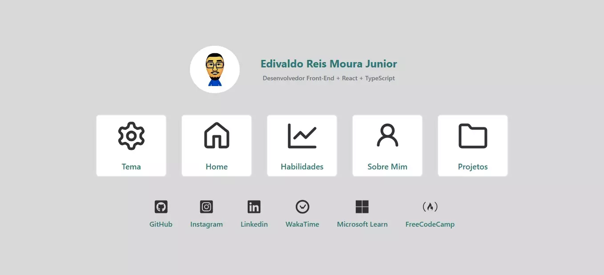

<h2>Portfólio Versão 2.0</h2>

Projeto Front-End com o objetivo mostrar todas as minhas características pessoais e técnicas através de um portfólio lembrando a forma de um currículo, bem como a mudanças de temas (Nintendo Switch e Wii U)

<h3>O projeto utiliza das seguintes tecnologias:</h3>

<table>
  <tr>
    <td>
      

        
      

    </td>
    <td>
      

        
      

    </td>
    <td>
      

        
      

    </td>
    <td>
      

        
      

    </td>
    <td>
      

        
      

    </td>
    <td>
      

        
      

    </td>
    <td>
      

        
      

    </td>
  </tr>
</table>

<h3>O projeto utiliza das seguintes ferramentas:</h3>

<table>
  <tr>
    <td>
      

        
      

    </td>
    <td>
      

        
      

    </td>
    <td>
      

        
      

    </td>
    <td>
      

        
      

    </td>
    <td>
      

        
      

    </td>
    <td>
      

        
      

    </td>
    <td>
      

        
      

    </td>
  </tr>
</table>

<h3>Site</h3>
<strong><a href="https://portfolio-v2-edijunior88.vercel.app/" target="_blank">https://portfolio-v2-edijunior88.vercel.app/</a></strong>

<h3>Status do Deploy</h3>

<h3>Versão Desktop / Tablet</h3>

<h3>Versão Mobile</h3>
<table align="center">
  <tr>
    <td>
      
    </td>
    <td>
      
    </td>
  </tr>
</table>

<h3>Tempo dedicado ao projeto</h3>

  

